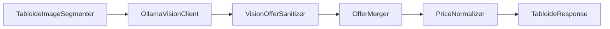
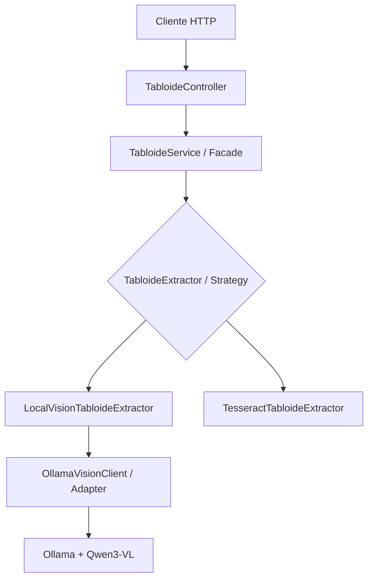

# Tabloide API

API REST em Java e Spring Boot que transforma imagens de tabloides de supermercado em dados estruturados. O projeto utiliza visão computacional com um modelo multimodal local, identifica ofertas, remove duplicidades e calcula preços comparáveis por quilograma, litro ou unidade.

> Projeto desenvolvido para o desafio **Explorando Padrões de Projetos na Prática com Java**, da DIO em parceria com o Itaú.

## O problema

Tabloides de supermercados geralmente são publicados como imagens. Isso dificulta pesquisar produtos, comparar preços ou criar alertas. A API recebe uma dessas imagens e devolve um JSON que pode ser consumido por aplicações de busca e monitoramento de promoções.

```text
Imagem do tabloide
        ↓
Validação e segmentação
        ↓
Extração multimodal local
        ↓
Sanitização e deduplicação
        ↓
Normalização de preços
        ↓
JSON estruturado por categoria
```

## Design Patterns aplicados

Os padrões foram usados para manter o processamento extensível e separar responsabilidades.

### Strategy

[`TabloideExtractor`](src/main/java/br/com/eduardo/tabloideapi/extractor/TabloideExtractor.java) define o contrato comum de extração. Atualmente existem duas estratégias:

- [`LocalVisionTabloideExtractor`](src/main/java/br/com/eduardo/tabloideapi/extractor/LocalVisionTabloideExtractor.java): estratégia principal, baseada no Ollama e em um modelo multimodal;
- [`TesseractTabloideExtractor`](src/main/java/br/com/eduardo/tabloideapi/extractor/TesseractTabloideExtractor.java): alternativa baseada em OCR tradicional.

A estratégia ativa é escolhida por configuração, sem alterar o controller ou o serviço:

```properties
tabloide.extractor=local-vision
```

Esse desenho segue o princípio **Open/Closed**: um novo extrator pode ser acrescentado implementando a interface, sem modificar o fluxo que o utiliza.

### Facade

[`TabloideService`](src/main/java/br/com/eduardo/tabloideapi/service/TabloideService.java) funciona como uma fachada para o caso de uso. O controller precisa conhecer apenas o método `processar`; validação da imagem, seleção da estratégia e execução da extração ficam escondidas atrás dessa interface simples.

### Adapter

[`OllamaVisionClient`](src/main/java/br/com/eduardo/tabloideapi/extractor/OllamaVisionClient.java) adapta os objetos da aplicação ao contrato HTTP do Ollama. Ele converte a imagem para Base64, monta a requisição do modelo, envia o schema JSON e transforma a resposta em records Java. Assim, detalhes externos não vazam para o controller.

### Pipeline de processamento

A estratégia multimodal organiza componentes especializados em sequência:



O pipeline não é apresentado como um padrão GoF isolado, mas como uma composição de responsabilidades pequenas que facilita testes e evolução.

### Padrões complementares

- **DTO:** records representam requisições internas e respostas sem expor componentes de infraestrutura.
- **Dependency Injection:** o Spring fornece as implementações pelo construtor, reduzindo acoplamento e facilitando testes.
- **Configuration Object:** [`TabloideProperties`](src/main/java/br/com/eduardo/tabloideapi/config/TabloideProperties.java) concentra configurações tipadas da aplicação.

## Arquitetura



## Tecnologias

- Java 25
- Spring Boot 4.1.1
- Maven
- Spring Web MVC e Validation
- Ollama
- Qwen3-VL 4B Instruct
- Tess4J/Tesseract como estratégia alternativa
- JUnit 5 e AssertJ

## Pré-requisitos

- JDK 25
- Maven 3.9 ou superior
- [Ollama](https://ollama.com/) instalado
- Modelo multimodal local:

```powershell
ollama pull qwen3-vl:4b-instruct
```

Confira se o modelo foi instalado:

```powershell
ollama list
```

## Como executar

Inicie a API dentro da pasta do projeto:

```powershell
mvn spring-boot:run
```

Quando o terminal informar que o Tomcat iniciou na porta 8080, envie uma imagem em outro PowerShell:

```powershell
curl.exe -X POST "http://localhost:8080/api/v1/tabloides/processar" -H "Accept: application/json" -F "file=@C:\workspace\tabloide-api\samples\tabloide.png"
```

O primeiro processamento pode levar alguns minutos em uma máquina sem GPU dedicada. A API registra no console o progresso da leitura do cabeçalho e das regiões da imagem.

Para observar o modelo carregado durante a execução:

```powershell
ollama ps
```

## Endpoint

### Processar um tabloide

```http
POST /api/v1/tabloides/processar
Content-Type: multipart/form-data
```

| Campo | Tipo | Obrigatório | Descrição |
|---|---|---:|---|
| `file` | arquivo | sim | Imagem PNG ou JPEG do tabloide |

Exemplo resumido de resposta:

```json
{
  "mercado": "redepas",
  "validade": {
    "inicio": "2026-09-15",
    "fim": "2026-09-17"
  },
  "categorias": [
    {
      "nome": "Bebidas",
      "produtos": [
        {
          "nome": "CERVEJA PILSEN",
          "marca": "ITAIPAVA",
          "quantidade": 350,
          "unidade": "ml",
          "preco": 2.79,
          "precoNormalizado": 7.97,
          "unidadeNormalizada": "l",
          "textoOriginal": "CERVEJA ITAIPAVA PILSEN 350ML R$2,79"
        }
      ]
    }
  ]
}
```

## Configuração

As propriedades ficam em [`application.properties`](src/main/resources/application.properties):

```properties
tabloide.extractor=local-vision
tabloide.ollama.base-url=http://localhost:11434
tabloide.ollama.model=qwen3-vl:4b-instruct
tabloide.image.header-ratio=0.20
tabloide.image.body-tiles=2
tabloide.image.tile-overlap=0.12
```

Para experimentar a estratégia tradicional:

```properties
tabloide.extractor=tesseract
```

## Testes

```powershell
mvn test
```

A suíte cobre normalização de preços, sanitização das respostas do modelo, deduplicação das regiões sobrepostas, segmentação da imagem e inicialização do contexto Spring.

## Decisões e aprendizados

- Um único prompt para a imagem inteira perdeu precisão em textos pequenos. A solução foi separar o cabeçalho e dividir o corpo em regiões ampliadas e sobrepostas.
- A sobreposição melhora a leitura nas bordas, mas pode repetir produtos. `OfferMerger` trata essas duplicidades.
- O modelo multimodal pode interpretar incorretamente nome, marca ou gramatura. Por isso a resposta é sanitizada e preserva `textoOriginal` para auditoria.
- Preços normalizados permitem comparar embalagens diferentes, por exemplo `350 ml` e `2 l`.
- Executar o modelo localmente mantém a imagem no computador e elimina custo por requisição, com o custo de maior tempo de processamento em CPU.

## Limitações

- A precisão depende da resolução e da legibilidade do encarte.
- A extração por IA é probabilística e deve permitir revisão humana antes da publicação.
- Em máquinas sem GPU compatível, uma imagem pode levar vários minutos.
- O endpoint ainda é síncrono; uma evolução natural é criar processamento assíncrono com consulta de status.

## Próximos passos

- Persistir tabloides e ofertas em banco de dados;
- disponibilizar uma etapa de revisão e correção;
- processar uploads de forma assíncrona;
- integrar a API ao frontend do Mercadinho Tracker;
- adicionar testes de integração com respostas simuladas do Ollama;
- permitir novos provedores multimodais usando o mesmo contrato de extração.

## Contexto acadêmico

Este repositório tem finalidade educacional. Ele demonstra como padrões de projeto ajudam a resolver problemas reais de extensibilidade, integração externa e organização de responsabilidades em uma aplicação Spring.
