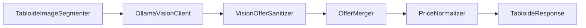
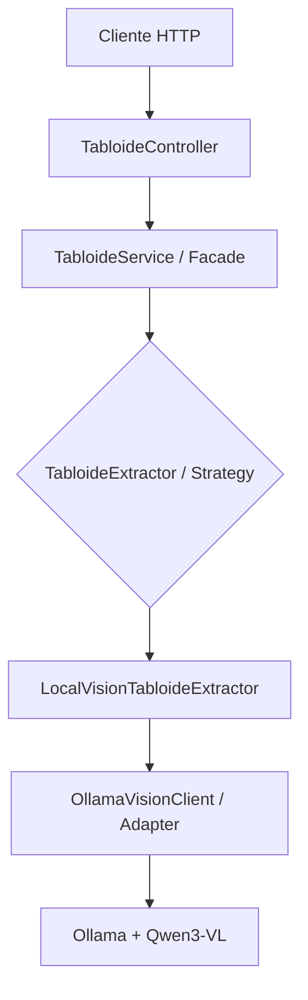

# Tabloide API

API REST em Java e Spring Boot que transforma imagens de tabloides de supermercado em dados estruturados. O projeto utiliza visão computacional com um modelo multimodal local, identifica ofertas, remove duplicidades e calcula preços comparáveis por quilograma, litro ou unidade.

> Projeto desenvolvido para o desafio **Explorando Padrões de Projetos na Prática com Java**, da DIO em parceria com o Itaú.

## O problema

Tabloides de supermercados geralmente são publicados como imagens. Isso dificulta pesquisar produtos, comparar preços ou criar alertas. A API recebe uma dessas imagens e devolve um JSON que pode ser consumido por aplicações de busca e monitoramento de promoções.

```text
Imagem do tabloide
        ↓
Validação e segmentação
        ↓
Extração multimodal local
        ↓
Sanitização e deduplicação
        ↓
Normalização de preços
        ↓
JSON estruturado por categoria
```

## Design Patterns aplicados

Os padrões foram usados para manter o processamento extensível e separar responsabilidades.

### Strategy

[`TabloideExtractor`](src/main/java/br/com/eduardo/tabloideapi/extractor/TabloideExtractor.java) define o contrato comum de extração. A implementação disponível atualmente é:

- [`LocalVisionTabloideExtractor`](src/main/java/br/com/eduardo/tabloideapi/extractor/LocalVisionTabloideExtractor.java): estratégia baseada no Ollama e em um modelo multimodal.

A estratégia ativa é escolhida por configuração, sem alterar o controller ou o serviço:

```properties
tabloide.extractor=local-vision
```

Mesmo com uma única implementação concreta neste momento, o serviço depende da abstração. Esse desenho segue o princípio **Open/Closed**: um novo extrator pode ser acrescentado implementando a interface, sem modificar o fluxo que o utiliza.

### Facade

[`TabloideService`](src/main/java/br/com/eduardo/tabloideapi/service/TabloideService.java) funciona como uma fachada para o caso de uso. O controller precisa conhecer apenas o método `processar`; validação da imagem, seleção da estratégia e execução da extração ficam escondidas atrás dessa interface simples.

### Adapter

[`OllamaVisionClient`](src/main/java/br/com/eduardo/tabloideapi/extractor/OllamaVisionClient.java) adapta os objetos da aplicação ao contrato HTTP do Ollama. Ele converte a imagem para Base64, monta a requisição do modelo, envia o schema JSON e transforma a resposta em records Java. Assim, detalhes externos não vazam para o controller.

### Pipeline de processamento

A estratégia multimodal organiza componentes especializados em sequência:



O pipeline não é apresentado como um padrão GoF isolado, mas como uma composição de responsabilidades pequenas que facilita testes e evolução.

### Padrões complementares

- **DTO:** records representam requisições internas e respostas sem expor componentes de infraestrutura.
- **Dependency Injection:** o Spring fornece as implementações pelo construtor, reduzindo acoplamento e facilitando testes.
- **Configuration Object:** [`TabloideProperties`](src/main/java/br/com/eduardo/tabloideapi/config/TabloideProperties.java) concentra configurações tipadas da aplicação.

## Arquitetura



## Tecnologias

- Java 25
- Spring Boot 4.1.1
- Maven
- Spring Web MVC
- Docker e Docker Compose
- Ollama
- Qwen3-VL 4B Instruct
- JUnit 5 e AssertJ

## Execução rápida com Docker Compose

Este é o modo recomendado para testar o projeto. É necessário apenas ter o Docker Desktop ou Docker Engine com Compose instalado; Java, Maven e Ollama ficam dentro dos containers. Na primeira execução são transferidos cerca de 7 a 8 GB. Depois do download e do build, o projeto ocupa aproximadamente 13 a 15 GB; recomenda-se ter 20 GB livres para uma instalação limpa.

```powershell
git clone https://github.com/efernandes91/tabloide-extractor-api.git
cd tabloide-extractor-api
docker compose up --build -d
```

O Compose executa automaticamente estas etapas:

1. inicia o Ollama;
2. baixa o modelo `qwen3-vl:4b-instruct`;
3. compila a API com Java 25;
4. inicia o Spring Boot somente quando o modelo está disponível.

### Espaço em disco

A estimativa abaixo foi medida no Docker Desktop com WSL 2, Ollama `0.34.1` e o modelo `qwen3-vl:4b-instruct`:

| Componente | Espaço aproximado |
| --- | ---: |
| Imagem do Ollama extraída | 9,2 GB |
| Modelo no volume `ollama-data` | 3,3 GB |
| Imagem da API | 0,5 GB |
| Cache de compilação | 1,3 GB |
| **Total após a preparação** | **14,3 GB** |

A imagem do Ollama baixa cerca de 3,7 GB compactada e fica maior depois de extraída. Durante a primeira execução, o Docker pode manter temporariamente dados compactados e extraídos ao mesmo tempo, elevando o uso para cerca de 16 a 18 GB. A recomendação de 20 GB livres inclui uma margem para esse pico; não significa que o projeto consumirá permanentemente todo esse espaço. Os serviços `ollama` e `ollama-model-pull` compartilham a mesma imagem, portanto ela não é armazenada duas vezes.

Os valores podem variar conforme a versão do Docker e a arquitetura do computador. Imagens, volumes e caches de outros projetos não estão incluídos nessa conta. Para conferir o consumo no seu ambiente:

```powershell
docker system df -v
```

Na primeira execução são baixadas as imagens Docker e alguns gigabytes do modelo. O processo pode demorar, mas o modelo fica salvo no volume `ollama-data` e não precisa ser baixado novamente nas próximas inicializações.

Para acompanhar o console do Spring Boot no IntelliJ ou em outro terminal:

```powershell
docker compose logs -f api
```

Como os containers foram iniciados com `-d`, `Ctrl+C` encerra apenas a visualização dos logs. A aplicação continua em execução.

Quando aparecer `Tomcat started on port 8080`, abra `http://localhost:8080` no navegador ou execute:

```powershell
curl.exe "http://localhost:8080/"
```

Resposta esperada:

```json
{
  "status": "UP",
  "mensagem": "Tabloide Extractor API está em execução.",
  "processamento": "POST /api/v1/tabloides/processar"
}
```

Comandos úteis:

```powershell
# Acompanhar a preparação do modelo e a API
docker compose logs -f ollama-model-pull api

# Iniciar novamente sem reconstruir as imagens
docker compose up -d

# Ver os serviços
docker compose ps

# Ver o modelo durante uma inferência
docker compose exec ollama ollama ps

# Encerrar, preservando o modelo baixado
docker compose down
```

Para apagar também o modelo e liberar o espaço do volume:

```powershell
docker compose down -v
```

> No Windows com GPU AMD, o container normalmente executará o modelo pela CPU. O resultado continua funcional, mas cada imagem pode levar vários minutos. Recomenda-se disponibilizar ao menos 8 GB de memória para o Docker Desktop.

## Execução local para desenvolvimento

Para executar sem containers, instale JDK 25, Maven 3.9+, [Ollama](https://ollama.com/) e o modelo:

```powershell
ollama pull qwen3-vl:4b-instruct
ollama list
mvn spring-boot:run
```

Nesse modo, a API usa o Ollama em `http://localhost:11434`. Para observar o modelo durante uma inferência, execute `ollama ps` em outro terminal.

## Teste rápido com cURL

Com a API pronta, execute dentro da pasta do projeto:

```powershell
curl.exe -X POST "http://localhost:8080/api/v1/tabloides/processar" -H "Accept: application/json" -F "file=@samples/tabloide.png"
```

O terminal da API mostra o progresso da leitura do cabeçalho e das regiões do tabloide.

## Endpoint

### Status da API

```http
GET /
```

Retorna `200 OK` quando o servidor HTTP da API está em execução. Pode ser acessado diretamente pelo navegador e não inicia o processamento de um tabloide.

```json
{
  "status": "UP",
  "mensagem": "Tabloide Extractor API está em execução.",
  "processamento": "POST /api/v1/tabloides/processar"
}
```

### Processar um tabloide

```http
POST /api/v1/tabloides/processar
Content-Type: multipart/form-data
```

| Campo | Tipo | Obrigatório | Descrição |
|---|---|---:|---|
| `file` | arquivo | sim | Imagem PNG ou JPEG do tabloide |

### Testar com Postman

Uma coleção pronta está disponível em [`postman/Tabloide-Extractor-API.postman_collection.json`](postman/Tabloide-Extractor-API.postman_collection.json). Importe o arquivo no Postman, abra **Processar tabloide**, selecione a imagem no campo `file` e clique em **Send**.

Para configurar manualmente:

1. Crie uma requisição `POST` para `http://localhost:8080/api/v1/tabloides/processar`.
2. Em **Headers**, adicione `Accept` com o valor `application/json`.
3. Em **Body**, selecione **form-data**.
4. Crie a chave `file`, altere seu tipo de **Text** para **File** e escolha uma imagem PNG ou JPEG.
5. Clique em **Send** e aguarde o processamento.

Não adicione o cabeçalho `Content-Type` manualmente. O Postman gera o `multipart/form-data` com o `boundary` correto. Como a inferência em CPU pode levar vários minutos, configure **Request timeout in ms** como `600000` ou `0` em **Settings > General**.

Exemplo resumido de resposta:

```json
{
  "mercado": "redepas",
  "validade": {
    "inicio": "2026-09-15",
    "fim": "2026-09-17"
  },
  "categorias": [
    {
      "nome": "Bebidas",
      "produtos": [
        {
          "nome": "CERVEJA PILSEN",
          "marca": "ITAIPAVA",
          "quantidade": 350,
          "unidade": "ml",
          "preco": 2.79,
          "precoNormalizado": 7.97,
          "unidadeNormalizada": "l",
          "textoOriginal": "CERVEJA ITAIPAVA PILSEN 350ML R$2,79"
        }
      ]
    }
  ]
}
```

## Configuração

As propriedades ficam em [`application.properties`](src/main/resources/application.properties):

```properties
tabloide.extractor=local-vision
tabloide.ollama.base-url=http://localhost:11434
tabloide.ollama.model=qwen3-vl:4b-instruct
tabloide.image.header-ratio=0.20
tabloide.image.body-tiles=2
tabloide.image.tile-overlap=0.12
```

No Compose, as propriedades principais são sobrescritas por variáveis de ambiente:

```yaml
TABLOIDE_OLLAMA_BASE_URL: http://ollama:11434
TABLOIDE_OLLAMA_MODEL: qwen3-vl:4b-instruct
```

`localhost` não deve ser usado entre containers: `ollama` é o nome do serviço na rede interna do Compose.

## Testes

```powershell
mvn test
```

A suíte cobre normalização de preços, sanitização das respostas do modelo, deduplicação das regiões sobrepostas, segmentação da imagem e inicialização do contexto Spring.

## Decisões e aprendizados

- Um único prompt para a imagem inteira perdeu precisão em textos pequenos. A solução foi separar o cabeçalho e dividir o corpo em regiões ampliadas e sobrepostas.
- A sobreposição melhora a leitura nas bordas, mas pode repetir produtos. `OfferMerger` trata essas duplicidades.
- O modelo multimodal pode interpretar incorretamente nome, marca ou gramatura. Por isso a resposta é sanitizada e preserva `textoOriginal` para auditoria.
- Preços normalizados permitem comparar embalagens diferentes, por exemplo `350 ml` e `2 l`.
- Executar o modelo localmente mantém a imagem no computador e elimina custo por requisição, com o custo de maior tempo de processamento em CPU.

## Limitações

- A precisão depende da resolução e da legibilidade do encarte.
- A extração por IA é probabilística e deve permitir revisão humana antes da publicação.
- Em máquinas sem GPU compatível, uma imagem pode levar vários minutos.
- O endpoint ainda é síncrono; uma evolução natural é criar processamento assíncrono com consulta de status.

## Próximos passos

- Persistir tabloides e ofertas em banco de dados;
- disponibilizar uma etapa de revisão e correção;
- processar uploads de forma assíncrona;
- integrar a API ao frontend do Mercadinho Tracker;
- adicionar testes de integração com respostas simuladas do Ollama;
- permitir novos provedores multimodais usando o mesmo contrato de extração.

## Contexto acadêmico

Este repositório tem finalidade educacional. Ele demonstra como padrões de projeto ajudam a resolver problemas reais de extensibilidade, integração externa e organização de responsabilidades em uma aplicação Spring.
